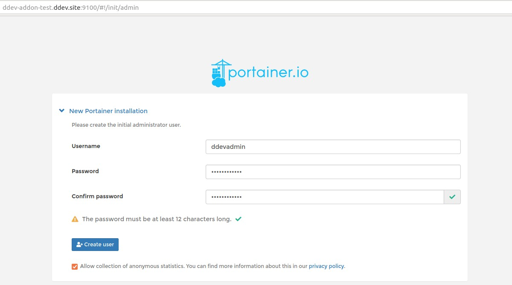

 

# ddev-portainer

<!-- START doctoc generated TOC please keep comment here to allow auto update -->
<!-- DON'T EDIT THIS SECTION, INSTEAD RE-RUN doctoc TO UPDATE -->
**Table of Contents**

- [Introduction](#introduction)
- [Installation](#installation)
- [Basic usage](#basic-usage)
- [Contribute](#contribute)

<!-- END doctoc generated TOC please keep comment here to allow auto update -->

## Introduction

[Portainer](https://www.portainer.io/) is a toolset that allows you to easy manage containers in Docker.

This DDEV add-on allows you to use [Portainer Community Edition (CE)](https://docs.portainer.io/#about-portainer) in a separate `portainer` service.

## Installation

`ddev get julienloizelet/ddev-portainer && ddev restart`

## Basic usage

Once ddev has been restarted, you should get the URL of your Portainer GUI by running `ddev describe`.

Browse to this URL and create your user:

Click the `Getting started` link and start using the Portainer GUI.

For more information, please read the [official documentation](https://docs.portainer.io/user/home).

## Contribute

Anyone is welcome to submit a PR to this repo.

**Contributed and maintained by [julienloizelet](https://github.com/julienloizelet)**

